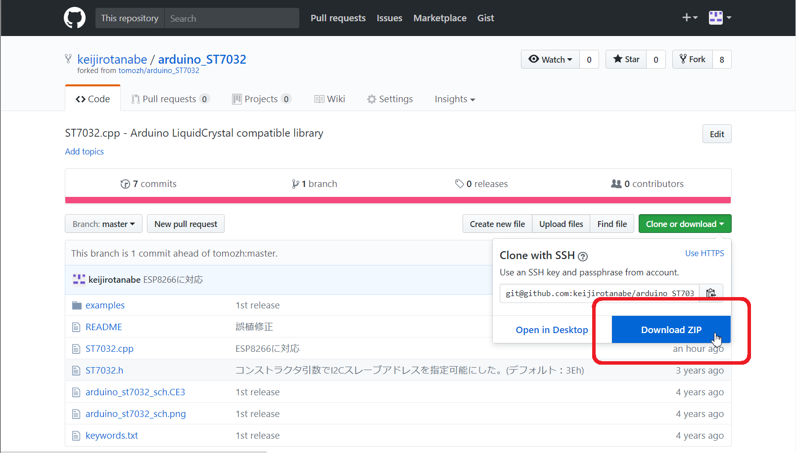

# カウンターの値を、I2C小型8x2LCDに表示

配線
 * IO14 --- タクトスイッチ
 * SDA  --- IO4
 * SCL  --- IO5

秋月の「[I2C接続小型8文字×2行液晶](http://akizukidenshi.com/catalog/g/gK-06795/)」を使用

# 使用ライブラリ

[arduino_ST7032](https://github.com/keijirotanabe/arduino_ST7032)

## 導入手順

### 1.ライブラリのダウンロード

### 2.ダウンロードしたフォルダを展開

### 3.ファイル名を「ST7032」に変更

### 4.「ST7032」を`ドキュメント > Arduino > libraries`の中へ移動

